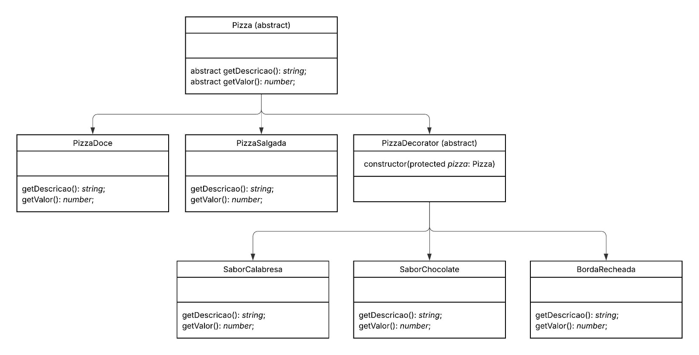

# Projeto Decorator - Sistema de Pizzas

Alunos: Alcemir Henrique, Caetano Camargo

Este projeto demonstra, de forma simples e direta, o padrão de projeto Decorator utilizando TypeScript.
O Decorator permite adicionar comportamentos extras a objetos de maneira flexível, sem precisar criar subclasses infinitas.
No exemplo do projeto, as pizzas podem ser manipuladas da forma como desejar, podendo adionar uma pizza com borda dupla, ou até mesmo uma pizza salgada com sabor chocolate caso assim o cliente queira.

---

## Funcionamento

- O Decorator basicamente cria uma forma de colocar o objeto dentro de cascas que adicionam corportamento a ela
- No exemplo do projeto ele utiliza **getValor()** para recuperar o valor, apos isso ele adiona o seu valor a soma e devolve.
- A abstração usada nas classes de pizza permitem que, seja colocado as cascas uma dentro das outras de maneira livre.

## Estrutura do Projeto

- Pizza — classe abstrata base
- PizzaDoce e PizzaSalgada — pizzas concretas
- PizzaDecorator — decorador abstrato
- SaborCalabresa, SaborChocolate — decoradores de sabor
- BordaRecheada — decorador adicional

---

## Diagrama UML



---

## Instalação e Execução

### Pré-requisitos
- Node.js instalado

### Passos

1. Clone o repositório
2. Instale as dependências: `npm install`
3. Compile o projeto: `npm run build`
4. Execute: `npm run start`

---

## Retorno esperado

```ts

--------------------INICIO-----------------------
-----------------PRIMEIRA PIZZA------------------
Pizza + Calabresa + Borda Recheada
Total: R$ 31
-----------------SEGUNDA PIZZA--------------------
Pizza Doce + Chocolate + Borda Recheada
Total: R$ 28
-----------------TERCEIRA PIZZA-------------------
Pizza + Calabresa
Total: R$ 25
--------------------FIM---------------------------
```